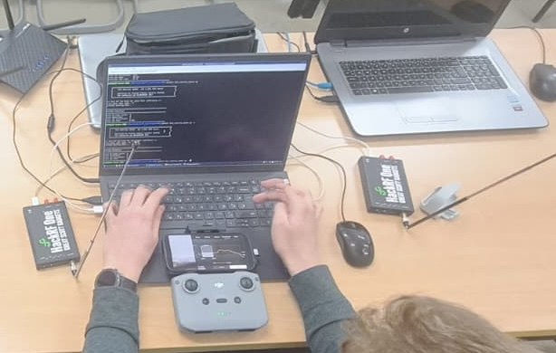

# HackRF Reactive Jammer

Fast reactive RF jammer for 2.4GHz FHSS signals using dual HackRF SDRs — tested on DJI Mini 2 SE.

> **⚠️ LEGAL DISCLAIMER**  
> This project is for **educational and research purposes only** in a **controlled lab environment**.  
> Unauthorized RF jamming is illegal in most jurisdictions and can result in severe penalties.  
> The authors assume no liability for misuse of this software.

---

## Overview

A reactive jammer that monitors the 2.4GHz ISM band and transmits interference only when drone communication is detected. This approach is more efficient than continuous jamming and harder to detect.

**Target:** DJI Mini 2 SE (OcuSync 2.0, 2.4GHz FHSS)  
**Hardware:** 2× HackRF One SDRs  
**Platform:** Developed and tested on [DragonOS](https://sourceforge.net/projects/dragonos-focal/) (Ubuntu-based SDR distro)

### How It Works

```
┌─────────────────────────────────────────────────────────────────┐
│                    REACTIVE JAMMER ARCHITECTURE                 │
├─────────────────────────────────────────────────────────────────┤
│                                                                 │
│   ┌─────────────┐         Detection Queue        ┌───────────┐  │
│   │  HackRF #0  │ ──── Sweep & Detect ────────▶  │ HackRF #1 │  │
│   │     (RX)    │    (5 freqs, ~40ms cycle)      │    (TX)   │  │
│   └─────────────┘                                └───────────┘  │
│         │                                              │        │
│         ▼                                              ▼        │
│   ┌───────────────────┐                    ┌─────────────────┐  │
│   │ Spectrum Monitor  │                    │  Noise Jammer   │  │
│   │ FFT → Threshold   │                    │ Gaussian Burst  │  │
│   └───────────────────┘                    └─────────────────┘  │
│                                                                 │
└─────────────────────────────────────────────────────────────────┘
```

1. **RX Thread** continuously sweeps across the 2.4GHz band (~40ms full sweep)
2. When signal exceeds calibrated noise floor + threshold → detection triggered
3. **TX Thread** instantly retunes and transmits wideband Gaussian noise
4. Jamming continues while activity persists, then returns to monitoring

---

## Repository Structure

```
hackrf-reactive-jam/
├── run.sh                    # Setup script & launch menu
├── config.yaml               # Jammer configuration (frequencies, timing, power)
├── fast_reactive_jammer.py   # Main reactive jammer implementation
├── test_hackrf_devices.py    # HackRF device detection & dependency test
├── requirements.txt          # Python dependencies
├── docs/                     # Documentation & presentations
│   ├── *.md                  # Lab documentation (markdown)
│   └── *.pdf                 # Presentation slides
├── legacyCode/               # Previous implementations & ML experiments
│   ├── reactive_jammer.py    # Earlier jammer with multiple modes
│   ├── lib/                  # ML classification attempts
│   └── ...
├── LICENSE
└── README.md
```

| File/Directory | Description |
|----------------|-------------|
| `run.sh` | Interactive setup script — creates venv, checks dependencies, launches jammer |
| `config.yaml` | All tunable parameters: frequencies, timing, thresholds, power |
| `fast_reactive_jammer.py` | Optimized dual-threaded reactive jammer (main script) |
| `test_hackrf_devices.py` | Verifies both HackRF devices are detected and GNU Radio works |
| `docs/` | Lab documentation and PDF presentations |
| `legacyCode/` | Archive of earlier implementations and ML-based detection experiments |

---

## Requirements

### Platform

> **Note:** This project was developed and tested exclusively on **DragonOS** (Ubuntu/Debian-based).  
> macOS *should* work if all dependencies are installed correctly via Homebrew, but this is **untested**.

### System Dependencies

These must be installed via your system package manager:

| Dependency | macOS (Homebrew) | Linux (apt) |
|------------|------------------|-------------|
| HackRF tools | `brew install hackrf` | `sudo apt install hackrf` |
| GNU Radio | `brew install gnuradio` | `sudo apt install gnuradio` |
| gr-osmosdr | `brew install gr-osmosdr` | `sudo apt install gr-osmosdr` |

### Python Dependencies

Installed automatically by `run.sh`:
- `numpy` — Signal processing
- `PyYAML` — Configuration parsing

---

## Quick Start

### 1. Clone & Setup

```bash
git clone https://github.com/yourusername/hackrf-reactive-jam.git
cd hackrf-reactive-jam

# Run the setup script
./run.sh setup
```

### 2. Verify Hardware

Connect both HackRF devices and run:

```bash
./run.sh test
```

Expected output:
```
[OK] Detected 2 HackRF device(s)
[OK] GNU Radio version: 3.10.x
[OK] OsmoSDR imported successfully
```

### 3. Run the Jammer

```bash
./run.sh jammer
```

Or use the interactive menu:

```bash
./run.sh
```

```
Main Menu
─────────────────────────────────────────
  1) Setup environment
  2) Check system dependencies
─────────────────────────────────────────
  3) Test HackRF devices
  4) Run Reactive Jammer
─────────────────────────────────────────
  0) Exit
```

---

## Configuration

All parameters are configured in `config.yaml`. The jammer will use hardcoded defaults if this file is missing.

### Device Assignment

```yaml
rx_device: "hackrf=0"    # Receiver (spectrum monitor)
tx_device: "hackrf=1"    # Transmitter (jammer)
```

Find device serial numbers with `hackrf_info` if you need to specify exact devices.

### Frequency Band

```yaml
freq_min: 2400           # Start of band (MHz)
freq_max: 2483.5         # End of band (MHz)

sweep_freqs:             # Center frequencies for sweep steps
  - 2410                 # Covers 2400-2420 MHz
  - 2430                 # Covers 2420-2440 MHz
  - 2450                 # Covers 2440-2460 MHz
  - 2470                 # Covers 2460-2480 MHz
  - 2490                 # Covers 2480-2500 MHz
```

### Timing (Critical for Performance)

```yaml
rx_dwell_time: 0.008     # 8ms per frequency → 40ms full sweep
tx_jam_duration: 0.015   # 15ms minimum jam burst
tx_holdoff: 0.002        # 2ms delay after jam before re-detecting
```

| Parameter | Effect of Lower Value | Effect of Higher Value |
|-----------|----------------------|------------------------|
| `rx_dwell_time` | Faster sweep, may miss weak signals | Slower sweep, better detection |
| `tx_jam_duration` | More agile, follows hops faster | More disruption per burst |
| `tx_holdoff` | Faster response, risk of self-interference | Slower response, cleaner detection |

### Detection Settings

```yaml
threshold_margin_db: 8   # dB above noise floor to trigger
calibration_samples: 50  # Samples for noise floor measurement
```

Lower threshold = more sensitive but more false positives.  
Recommended range: 6-10 dB.

### Transmitter Power

```yaml
tx_power_dbm: 10         # HackRF range: -10 to +10 dBm
```

10 dBm is sufficient for close-range lab testing.

### Runtime

```yaml
duration: 300            # Run for 5 minutes (0 = unlimited)
```

---

## Usage

### Basic Operation

```bash
# With calibration (recommended)
./run.sh jammer
# Select option 1

# Skip calibration (use defaults)
./run.sh jammer
# Select option 2
```

### Calibration Process

1. **Turn OFF the drone** before starting
2. Press Enter to begin noise floor calibration
3. Wait for calibration to complete (~2-3 seconds)
4. **Turn ON the drone** when prompted
5. Press Enter to start hunting

### During Operation

The jammer displays real-time statistics:

```
[45s] sweeps:1125 (25/s) | detect:47 | jams:23 | last:2450MHz
[JAM] 2430MHz | pwr=3.21e-05 | lat=2.1ms
```

- **sweeps**: Total RX sweep cycles
- **detect**: Number of activity detections
- **jams**: Number of jam activations
- **lat**: Detection-to-jam latency

### Stopping

Press `Ctrl+C` to stop. Session statistics will be displayed.

---

## Physical Setup

### Lab Configuration



*Complete lab setup: Dual HackRF One SDRs (left and right), laptop running DragonOS with the reactive jammer, and DJI Mini 2 SE controller for monitoring signal status.*

**Hardware Components:**
- 2× HackRF One SDRs with 2.4GHz antennas
- USB 3.0 hub (recommended for stable data transfer)
- Laptop running DragonOS (Ubuntu-based SDR distribution)
- DJI Mini 2 SE drone + controller (target device)

### Spectrum Analysis


*Spectrum analyzer waterfall display showing DJI OcuSync 2.0 FHSS hopping pattern in the 2.4GHz ISM band. The horizontal striping pattern reveals the frequency-hopping behavior that the reactive jammer tracks and disrupts.*

---

## Testing on DJI Mini 2 SE

### Results: Signal Degradation Under Jamming

The DJI Fly app's Transmission tab provides real-time signal quality metrics. Below are captures during active jamming:

| Normal Operation | Under Jamming |
|------------------|---------------|
| Signal: -50 to -60 dBm | Signal: -70 to -80 dBm |
| Status: Stable | Status: Unstable |
| Full control | Degraded/lost control |

### Jamming Effect on 2444-2464 MHz Band


*DJI controller showing signal degradation at -70.4 dBm in the 2444.5-2464.5 MHz range. Note the "Unstable" indicator and degraded video feed (left side). The downlink quality bar shows yellow/red status.*

### Jamming Effect on 2457-2477 MHz Band


*Controller displaying -76.8 dBm signal strength in the 2457.5-2477.5 MHz band. The reactive jammer successfully tracked the frequency hop and maintained disruption across the new band.*

### Observed Effects

- **Video Feed:** Degraded quality, artifacts, freezing, or complete loss
- **Control Latency:** Increased from ~50ms to 200ms+ before disconnect
- **RTH Trigger:** Drone initiates Return-to-Home when signal quality drops below threshold
- **Effective Range:** Jamming effective within ~10-15m in lab environment (depends on TX power and antenna gain)

---

## Troubleshooting

### "hackrf_info: command not found"
HackRF tools not installed. See [Requirements](#requirements).

### "Cannot import gnuradio"
GNU Radio not installed or not in Python path. Ensure you installed via system package manager, not pip.

### "No HackRF devices found"
- Check USB connections
- Try different USB ports (USB 3.0 recommended)
- Run `hackrf_info` to verify detection
- Ensure both devices have different serial numbers

### "Calibration failed"
- Ensure drone is OFF during calibration
- Check RX device connection
- Increase `calibration_samples` in config

### High false positive rate
- Increase `threshold_margin_db` (try 10-12)
- Ensure clean RF environment during calibration
- Check for interference from WiFi routers

---

## License

See [LICENSE](LICENSE) for details.

---

## Acknowledgments

Built for RF security research. Use responsibly.
