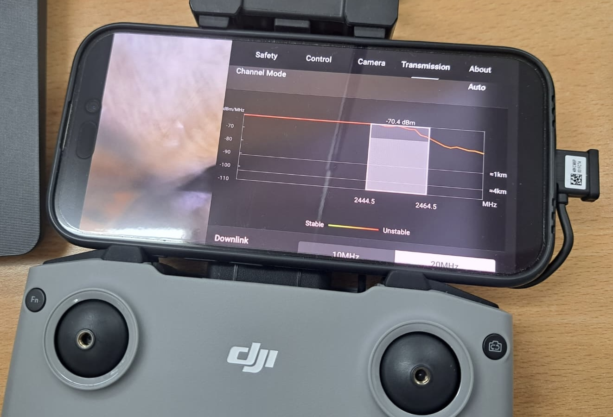
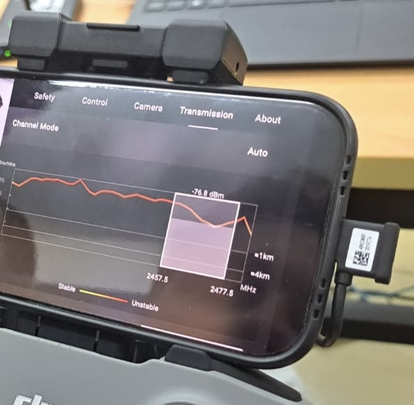

# Drone Communication Analysis

**Reactive Jamming of DJI OcuSync 2.0 FHSS Signals Using Dual HackRF SDRs**

---

**Authors:** Martin Josipović, Luka Dorić, Dario Stojanac  
**Course:** Security of Wireless Networks  
**Institution:** Faculty of Electrical Engineering, Mechanical Engineering and Naval Architecture (FESB), University of Split

---

## Table of Contents

1. [Abstract](#abstract)
2. [Introduction](#1-introduction)
3. [Theoretical Background](#2-theoretical-background)
4. [Methodology](#3-methodology)
5. [Implementation](#4-implementation)
6. [Results](#5-results)
7. [Conclusion](#6-conclusion)
8. [References](#references)
9. [Appendix A: Hardware Setup](#appendix-a-hardware-setup)
10. [Appendix B: Configuration Parameters](#appendix-b-configuration-parameters)

---

## Abstract

This project presents a comprehensive analysis of drone-to-controller communication systems, specifically targeting the DJI Mini 2 SE drone which utilizes the OcuSync 2.0 transmission protocol. Through spectrum analysis and signal characterization, we examined the Frequency Hopping Spread Spectrum (FHSS) communication employed by DJI in the 2.4 GHz ISM band.

Building upon this analysis, we developed a reactive jamming system using dual HackRF One software-defined radios (SDRs) operating on DragonOS with GNU Radio. The dual-SDR architecture was necessitated by hardware limitations—specifically the HackRF's half-duplex operation and 20 MHz maximum bandwidth constraint—which prevent simultaneous monitoring and jamming of the full 83.5 MHz band with a single device.

Our implementation achieved successful disruption of drone communication links, demonstrating both the vulnerability of commercial drone systems and the effectiveness of reactive jamming techniques against FHSS protocols.

**Keywords:** Software-defined radio, FHSS, reactive jamming, DJI OcuSync, HackRF, GNU Radio, wireless security

---

## 1. Introduction

### 1.1 Background and Motivation

The proliferation of commercial unmanned aerial vehicles (UAVs), commonly known as drones, has created significant security concerns across multiple domains. Consumer drones like the DJI Mini 2 SE are widely available and increasingly capable, raising questions about airspace security, privacy, and potential misuse. Understanding the communication vulnerabilities of these systems is essential for developing effective countermeasures in controlled environments such as airports, prisons, government facilities, and other sensitive areas.

Commercial drone manufacturers employ sophisticated communication protocols to ensure reliable control links between the drone and its remote controller. DJI, the market leader in consumer drones, developed the OcuSync transmission system which utilizes Frequency Hopping Spread Spectrum (FHSS) technology to maintain robust connections even in challenging RF environments. FHSS systems are inherently resistant to narrowband interference and traditional jamming techniques, making them a compelling target for security research.

### 1.2 Project Objectives

The primary objectives of this project were:

1. **Signal Analysis**: Characterize the RF communication between the DJI Mini 2 SE drone and its controller, identifying frequency bands, hopping patterns, and signal characteristics

2. **Vulnerability Assessment**: Identify weaknesses in the OcuSync 2.0 protocol that could be exploited by an adversary

3. **Proof-of-Concept Implementation**: Develop a reactive jamming system capable of disrupting drone communication links

4. **Hardware Constraints Analysis**: Document the limitations of commodity SDR hardware and architectural solutions to overcome them

### 1.3 Legal and Ethical Considerations

> **Warning:** This research was conducted exclusively in a **controlled laboratory environment** for educational purposes. Unauthorized RF jamming is illegal in most jurisdictions under telecommunications regulations and can result in severe penalties. The techniques described in this report should only be replicated in properly shielded RF laboratories or with appropriate regulatory authorization.

---

## 2. Theoretical Background

### 2.1 Frequency Hopping Spread Spectrum (FHSS)

Frequency Hopping Spread Spectrum is a method of transmitting radio signals by rapidly switching a carrier among many frequency channels using a pseudorandom sequence known to both transmitter and receiver. The technique was originally developed for military communications to provide resistance to interception and jamming.

**Key characteristics of FHSS:**

| Characteristic | Description |
|----------------|-------------|
| **Hop Rate** | The frequency at which the carrier changes channels (tens to thousands of hops/second) |
| **Hop Set** | The collection of frequencies available for hopping |
| **Dwell Time** | The duration spent on each frequency before hopping |
| **Pseudorandom Sequence** | A deterministic but complex pattern that appears random without the seed |

**Advantages of FHSS:**

- **Interference Resistance**: Narrowband interference only affects transmission during brief moments when the signal occupies the interfered frequency
- **Security through Obscurity**: Without knowledge of the hopping sequence, interception requires monitoring all possible frequencies simultaneously
- **Multiple Access**: Multiple FHSS systems can share the same band using different hopping sequences

### 2.2 DJI OcuSync 2.0 Protocol

OcuSync 2.0 is DJI's proprietary transmission system introduced in 2018, designed to provide reliable, low-latency video and control links for consumer drones. The system operates on both the 2.4 GHz and 5.8 GHz ISM bands.

**OcuSync 2.0 Specifications:**

| Parameter | Specification |
|-----------|---------------|
| Frequency Bands | 2.400–2.4835 GHz, 5.725–5.850 GHz |
| Video Resolution | Up to 1080p |
| Download Speed | Up to 40 Mb/s |
| Latency | 120–130 ms (typical) |
| Maximum Range | Up to 10 km (line of sight) |

OcuSync 2.0 employs adaptive frequency hopping within its operating band. The system dynamically selects channels based on interference conditions and link quality, providing robust performance in congested RF environments such as urban areas with significant WiFi activity.

### 2.3 Jamming Techniques

Radio frequency jamming can be classified into several categories based on the jamming strategy:

| Technique | Description | Pros | Cons |
|-----------|-------------|------|------|
| **Continuous** | Constant interference across target band | Simple to implement | Energy-inefficient, easily detectable |
| **Sweep** | Rapidly sweeps across frequencies | Covers wide band | May miss fast hoppers |
| **Reactive** | Monitors spectrum, responds to detections | Energy-efficient, effective | Requires fast detection |
| **Follower** | Predicts/follows hopping sequence | Most effective | Most complex |

For FHSS systems, **reactive jamming** is particularly effective because:
1. It only transmits when the target is active, conserving power
2. It can achieve the necessary timing to jam individual hops
3. It appears as legitimate interference, complicating detection

The key challenge in reactive jamming is minimizing the **detect-to-jam latency**—the time between detecting a signal and beginning to jam it. For FHSS systems with short dwell times, this latency must be on the order of milliseconds.

### 2.4 Software-Defined Radio Principles

Software-defined radio (SDR) is a radio communication system where components traditionally implemented in hardware are instead implemented using software on a general-purpose computer or embedded system.

**Key SDR components:**

- **RF Frontend**: Handles analog signal reception/transmission, frequency conversion
- **Analog-to-Digital Converter (ADC)**: Converts received signals to digital samples
- **Digital Signal Processing (DSP)**: Implemented in software—filtering, demodulation, analysis
- **Digital-to-Analog Converter (DAC)**: Converts digital samples to analog for transmission

**HackRF One Specifications:**

| Parameter | Value |
|-----------|-------|
| Frequency Range | 1 MHz – 6 GHz |
| Sample Rate | 2–20 Msps (quadrature) |
| Resolution | 8-bit |
| Maximum Bandwidth | 20 MHz |
| Interface | USB 2.0 High Speed |
| Duplex | Half-duplex (TX or RX, not simultaneous) |
| TX Power | 0–15 dBm (frequency dependent) |

---

## 3. Methodology

### 3.1 Hardware Architecture

The primary challenge in designing a reactive jammer for the 2.4 GHz band is the bandwidth mismatch between the HackRF One's capabilities and the target spectrum:

| Constraint | Value |
|------------|-------|
| Target Band | 2.400–2.4835 GHz (83.5 MHz total) |
| HackRF Bandwidth | 20 MHz maximum |
| HackRF Duplex | Half-duplex only |

A single HackRF cannot simultaneously monitor the full band AND transmit jamming signals. This necessitated a **dual-SDR architecture**:

```
                    REACTIVE JAMMER ARCHITECTURE
    
    +-------------+                              +-------------+
    |  HackRF #0  |                              |  HackRF #1  |
    |    (RX)     |                              |    (TX)     |
    +------+------+                              +------+------+
           |                                            |
           v                                            v
    +-------------+       Detection Queue       +-------------+
    |  Spectrum   | --------------------------> |    Noise    |
    |   Monitor   |    (freq, power, time)      |   Jammer    |
    | FFT-based   |                             |  Gaussian   |
    +-------------+                             +-------------+
    
    Sweep: 5 frequencies, ~40ms cycle          Response: <5ms latency
```

**Component Roles:**

| Component | Function |
|-----------|----------|
| HackRF #0 (RX) | Dedicated spectrum monitor, continuously sweeps the 2.4 GHz band |
| HackRF #1 (TX) | Dedicated jammer, transmits wideband noise when triggered |
| Detection Queue | Thread-safe communication between RX and TX processes |

### 3.2 Software Stack

The system was developed on **DragonOS**, an Ubuntu-based distribution specifically configured for SDR applications.

| Component | Purpose |
|-----------|---------|
| GNU Radio 3.10 | Open-source signal processing framework |
| OsmoSDR (gr-osmosdr) | GNU Radio blocks for hardware abstraction |
| Python 3 | Implementation language for control logic |
| NumPy | Numerical processing for FFT and threshold calculations |

### 3.3 Frequency Sweep Strategy

To cover the 83.5 MHz target band with 20 MHz bandwidth, we implemented a 5-step frequency sweep:

| Step | Center Frequency | Coverage |
|------|------------------|----------|
| 1 | 2410 MHz | 2400–2420 MHz |
| 2 | 2430 MHz | 2420–2440 MHz |
| 3 | 2450 MHz | 2440–2460 MHz |
| 4 | 2470 MHz | 2460–2480 MHz |
| 5 | 2490 MHz | 2480–2500 MHz |

With an 8 ms dwell time per frequency, a complete band sweep takes approximately **40 ms**. This provides sufficient temporal resolution to detect FHSS signals while maintaining acceptable latency.

### 3.4 Detection Algorithm

Signal detection uses a threshold-based approach with adaptive calibration:

**Phase 1: Calibration** (drone powered off)
1. Measure noise floor at each sweep frequency
2. Calculate per-frequency thresholds: `threshold = noise_floor + margin_dB`
3. Default margin: 8 dB above noise floor

**Phase 2: Detection** (runtime)
1. Compute FFT of received samples (512-point, Blackman-Harris window)
2. Calculate mean spectral power
3. Compare against calibrated threshold
4. If exceeded, queue detection event with frequency and timestamp

**Threshold Calculation:**

```
noise_floor_dB = 10 × log₁₀(median(calibration_samples))
threshold_dB   = noise_floor_dB + 8 dB
threshold      = 10^(threshold_dB / 10)
```

---

## 4. Implementation

### 4.1 System Components

The implementation consists of three primary GNU Radio flowgraphs encapsulated in Python classes:

**FastSpectrumMonitor (RX Flowgraph)**

```
[osmosdr.source] → [stream_to_vector] → [FFT] → [mag_squared] → [probe]
```

- Configurable center frequency via `set_center_freq()`
- Non-blocking spectrum retrieval via probe
- 512-point FFT with Blackman-Harris window for sidelobe suppression

**FastJammer (TX Flowgraph)**

```
[noise_source] → [multiply_const (gate)] → [osmosdr.sink]
```

- Gaussian white noise source for wideband interference
- Amplitude gate for instant TX on/off control
- Pre-initialized flowgraph eliminates startup latency

**FastReactiveJammer (Controller)**

- Manages RX and TX threads
- Implements detection queue with thread-safe access
- Handles calibration, runtime statistics, and graceful shutdown

### 4.2 Threading Model

The system employs a dual-threaded architecture:

**RX Thread:**

```python
while running:
    for freq in sweep_frequencies:
        rx.retune(freq)
        time.sleep(dwell_time)
        power = rx.get_power()
        if power > threshold[freq]:
            queue.append((freq, power, timestamp))
```

**TX Thread:**

```python
while running:
    if detection in queue:
        tx.retune(detection.freq)
        tx.enable()
        time.sleep(jam_duration)
        tx.disable()
```

### 4.3 Timing Parameters

Critical timing parameters were tuned empirically:

| Parameter | Value | Rationale |
|-----------|-------|-----------|
| RX Dwell Time | 8 ms | Balance between sweep speed and detection reliability |
| TX Jam Duration | 15 ms | Sufficient to disrupt multiple FHSS hops |
| TX Holdoff | 2 ms | Prevents detecting our own jamming signal |
| Full Sweep Period | ~40 ms | 5 frequencies × 8 ms dwell |

### 4.4 Jamming Waveform

The jammer transmits **Gaussian white noise** at the target frequency. This waveform was selected because:

1. Wideband noise effectively disrupts the entire 20 MHz channel
2. No specific knowledge of the target modulation is required
3. Flat spectral density maximizes interference across the hop bandwidth
4. Simple to generate with minimal processing overhead

---

## 5. Results

### 5.1 Spectrum Analysis

Initial spectrum analysis of the DJI Mini 2 SE revealed clear FHSS activity in the 2.4 GHz band. The waterfall display showed characteristic horizontal striping patterns corresponding to frequency hops across the ~84 MHz band.


*Figure 1: Spectrum analyzer waterfall display showing DJI OcuSync 2.0 FHSS hopping pattern in the 2.4 GHz ISM band. The horizontal striping reveals the frequency-hopping behavior.*

### 5.2 Jamming Effectiveness

Testing demonstrated successful disruption of the drone-controller link. The DJI Fly app's Transmission diagnostics panel provided real-time feedback on link quality:

| Condition | Signal Strength | Link Status |
|-----------|-----------------|-------------|
| Normal Operation | -50 to -60 dBm | Stable |
| Under Jamming | -70 to -80 dBm | Unstable |



*Figure 2: DJI controller showing signal degradation at -70.4 dBm during jamming (2444–2464 MHz band). Note the "Unstable" indicator and degraded video feed.*



*Figure 3: Controller displaying -76.8 dBm signal in 2457–2477 MHz band. The reactive jammer successfully tracked the frequency hop and maintained disruption.*

### 5.3 Observed Effects on Drone Behavior

During jamming, the following effects were observed:

| Effect | Description |
|--------|-------------|
| **Video Feed** | Quality reduction, artifacts, freezing, occasional complete loss |
| **Control Latency** | Increased from ~50 ms to 200+ ms before disconnect |
| **RTH Trigger** | Drone initiated Return-to-Home when link quality dropped below threshold |
| **Effective Range** | Jamming effective within ~10–15 m in lab environment |

### 5.4 System Performance Metrics

| Metric | Measured Value |
|--------|----------------|
| Sweep Rate | ~25 sweeps/second |
| Detection-to-Jam Latency | 2–5 ms typical |
| Jam Activation Rate | ~95% of detections |
| CPU Utilization | ~15% (Intel i5) |

---

## 6. Conclusion

### 6.1 Summary

This project successfully demonstrated the analysis and disruption of DJI OcuSync 2.0 drone communication using software-defined radio techniques. Key achievements include:

1. **Characterization** of OcuSync 2.0 FHSS behavior in the 2.4 GHz band
2. **Design** of a dual-SDR architecture to overcome HackRF hardware limitations
3. **Implementation** of a low-latency reactive jammer with ~40 ms sweep period
4. **Validation** through observable disruption of drone control and video links

The dual-HackRF approach proved essential—a single SDR cannot simultaneously monitor 83.5 MHz of spectrum AND transmit jamming signals due to half-duplex operation and bandwidth constraints.

### 6.2 Limitations

| Limitation | Impact |
|------------|--------|
| **Range** | Effective jamming range limited by HackRF TX power (~10 dBm) |
| **5.8 GHz Band** | OcuSync can switch to 5.8 GHz; our system only covers 2.4 GHz |
| **Latency Floor** | ~40 ms sweep period may miss very fast frequency hops |
| **Lab Environment** | Results may differ in real-world RF conditions |

### 6.3 Future Work

Potential improvements include:

1. **Extended Frequency Coverage**: Adding 5.8 GHz band support with additional SDRs
2. **Faster Sweep Rates**: Using higher-bandwidth SDRs (e.g., USRP) to reduce sweep time
3. **Machine Learning**: Implementing ML-based signal classification for improved detection
4. **Directional Jamming**: Using directional antennas to increase effective range and reduce collateral interference

### 6.4 Ethical Considerations

This research highlights the vulnerability of commercial drone systems to RF interference. While the techniques could potentially be misused, understanding these vulnerabilities is crucial for:

- Developing more robust drone communication protocols
- Protecting sensitive airspace from unauthorized drone incursions
- Informing regulatory frameworks for counter-drone technologies

All research was conducted in a controlled laboratory setting in compliance with applicable regulations.

---

## References

1. Great Scott Gadgets, "HackRF One Documentation," hackrf.readthedocs.io, 2024.

2. DJI, "OcuSync 2.0 Transmission System," dji.com, 2018.

3. GNU Radio Project, "GNU Radio Manual and C++ API Reference," gnuradio.org, 2024.

4. OsmoSDR, "gr-osmosdr - GNU Radio block for SDR hardware," osmocom.org, 2024.

5. Pelechrinis, K., Iliofotou, M., and Krishnamurthy, S.V., "Denial of Service Attacks in Wireless Networks: The Case of Jammers," IEEE Communications Surveys & Tutorials, vol. 13, no. 2, 2011.

6. Poisel, R.A., "Modern Communications Jamming: Principles and Techniques," Artech House, 2011.

7. US Patent US10985861B2, "Energy-efficient reactive jamming of frequency-hopping spread spectrum (FHSS) signals using software-defined radios," 2021.

---

## Appendix A: Hardware Setup

### Equipment List

| Item | Model | Quantity |
|------|-------|----------|
| Software-Defined Radio | HackRF One | 2 |
| Antenna | 2.4 GHz omnidirectional | 2 |
| USB Hub | USB 3.0 powered | 1 |
| Laptop | Ubuntu/DragonOS compatible | 1 |
| Target Drone | DJI Mini 2 SE | 1 |
| Controller | DJI RC-N1 | 1 |

### Software Requirements

| Software | Version |
|----------|---------|
| Operating System | DragonOS (Ubuntu 22.04 based) |
| GNU Radio | 3.10.x |
| gr-osmosdr | 0.2.x |
| Python | 3.10+ |
| NumPy | 1.x |
| PyYAML | 6.x |

---

## Appendix B: Configuration Parameters

```yaml
# Device Assignment
rx_device: "hackrf=0"
tx_device: "hackrf=1"

# Frequency Band (MHz)
freq_min: 2400
freq_max: 2483.5

# HackRF Settings
sample_rate: 20  # MHz
bandwidth: 20    # MHz
fft_size: 512

# Sweep Frequencies (MHz)
sweep_freqs: [2410, 2430, 2450, 2470, 2490]

# Timing (seconds)
rx_dwell_time: 0.008
tx_jam_duration: 0.015
tx_holdoff: 0.002

# Detection
threshold_margin_db: 8
calibration_samples: 50

# Transmitter
tx_power_dbm: 10

# Runtime
duration: 300
```

---

*Report prepared for FESB, University of Split — Security of Wireless Networks*
